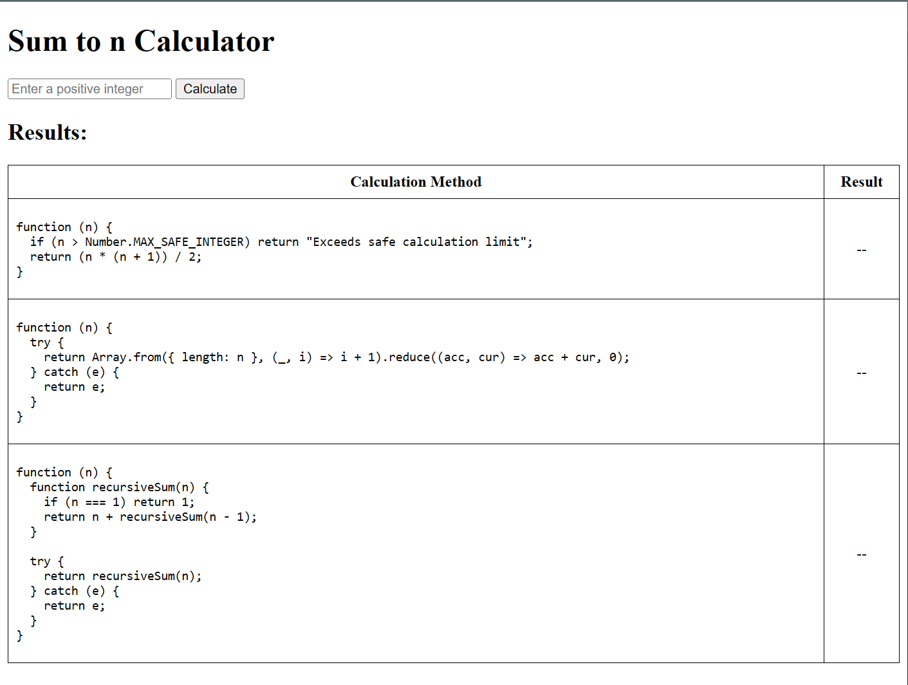

# Solution for Problem 1

This folder contains the solution to **Problem 1**. The detailed solution can be found in the `solution.js` file.

You can view the live version of the solution at the following link:

[View live version here](https://problem1-b84zxpkoa-ductrans-projects-b754fc48.vercel.app)

[](https://problem1-b84zxpkoa-ductrans-projects-b754fc48.vercel.app)

### 1. Using the Gauss formula

```javascript
// Method 1: Using the Gauss formula
// This is the most efficient method (of course :v)
// The formula itself doesn't require any special limits to work for typical use cases
// The only reason for having a limit check would be to handle potential overflow or inaccuracies when dealing with numbers that exceed the safe integer range in JavaScript
var sum_to_n_a = function (n) {
  if (n > Number.MAX_SAFE_INTEGER) return "Exceeds safe calculation limit";
  return (n * (n + 1)) / 2;
};
```

### 2. Using Array.from() and reduce()

```javascript
// Method 2: Using Array.from() and reduce()
// I prefer this method over using for or while loops for readability and maintainability
// While it may not be as performant and could consume more memory when n is large, it provides a more concise and functional approach
// Must use try-catch here due to the array length limit. However, it is not required for typical use cases
var sum_to_n_b = function (n) {
  try {
    return Array.from({ length: n }, (_, i) => i + 1).reduce((acc, cur) => acc + cur, 0);
  } catch (e) {
    return e;
  }
};
```

### 3. Using recursion

```javascript
// Method 3: Using recursion
// While it's a neat and functional way to express the solution, it can be less efficient and lead to a stack overflow for large values of n due to deep recursion
// Must use try-catch here due to the maximum call stack size. However, for typical use cases, only need to use the recursiveSum function
var sum_to_n_c = function (n) {
  function recursiveSum(n) {
    if (n === 1) return 1;
    return n + recursiveSum(n - 1);
  }

  try {
    return recursiveSum(n);
  } catch (e) {
    return e;
  }
};
```
